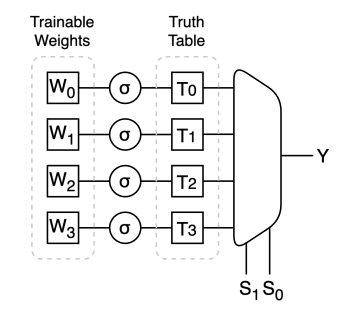
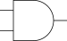
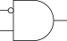
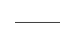
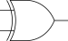
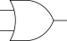
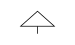
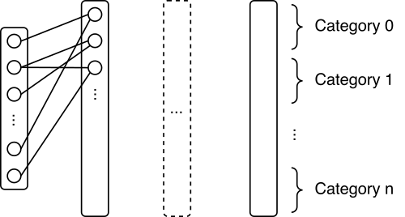

# Softmux: Growing Digital Circuits with Deep Learning

This project explores _growing_ digital circuits using deep learning techniques. At its core is a learnable component called Softmux, capable of representing arbitrary _n_-input Boolean functions. Softmux units take the place of traditional neurons, forming a sparsely connected network where each unit learns a logic function.

During training, fuzzy bits — continuous values in the range [0, 1] — propagate through the network, enabling gradient-based optimization. After training, the network is discretized — replacing fuzzy bits with hard binary bits — resulting in a structure that can be directly translated into a digital circuit.

  

Early results on classic classification benchmarks show that the approach achieves competitive accuracy, which is largely retained even after full discretization.

## Related Work
[Deep Differentiable Logic Gate Networks](https://github.com/Felix-Petersen/difflogic)

## Softmux Unit

A Softmux is a differentiable logic-based computation unit capable of representing arbitrary _n_-input Boolean functions. It behaves like a soft multiplexer, where the inputs select from a trainable truth table that can be continuously optimized via gradient descent.

  

Particularly a 2-input Softmux takes two fuzzy binary inputs, S0 and S1, and has four trainable parameters W = [W0, W1, W2, W3]. The weights are squashed — Tk = σ(Wk) — into the [0, 1] range using a smooth, bounded activation function (e.g.,  sigmoid). Each squashed weight, Tk, correspond to one entry in the 2-input truth table (aka 2-input LUT) that defines the logic function. 

| S0 | S1 | Selection   |
|----|----|-------------|
| 0  | 0  | T0          |
| 0  | 1  | T1          |
| 1  | 0  | T2          |
| 1  | 1  | T3          |

The output is a weighted interpolation of the truth table entries, guided by the selector inputs, resulting in a value bounded within the [0, 1] range.

$$
Y = (1 − S0)(1 − S1)T0 +
    (1 − S0)(    S1)T1 +
    (    S0)(1 − S1)T2 + 
    (    S0)(    S1)T3
$$

This setup enables gradient-based optimization of logic behavior, making Softmux units compatible with standard deep learning pipelines while remaining interpretable as logic primitives. 

After training, the truth table entries are discretized — each value snapping to either 0 or 1 — allowing pure binary logic functions to emerge. These can then be directly translated into a digital circuit representation.

| Function Id | Function Name   | Symbol                                            |
|-------------|-----------------|-------------------------------------------------|
| 0000        | FALSE           |  |
| 0001        | AND             |  |
| 0010        | A!B             |  |
| 0011        | A               |  |
| 0100        | !AB             |  |
| 0101        | B               |  |
| 0110        | XOR             |  |
| 0111        | OR              |  |
| 1000        | NOR             |  |
| 1001        | XNOR            |  |
| 1010        | !B              |  |
| 1011        | A+!B            |  |
| 1100        | !A              |  |
| 1101        | !A+B            |  |
| 1110        | NAND            |  |
| 1111        | TRUE            |  |

## Softmux Network
A Softmux Network is a sparse, multi-layer architecture built from Softmux units. Each layer consists of a collection of Softmux units, each connected to a subset of units from  previous layers. This sparse connectivity mimics traditional digital logic designs. 

The final layer outputs multiple bits per class, with each bit acting as a voter. These votes are summed per class to produce class scores, forming a simple majority-voting mechanism. The class with the highest score is selected as the prediction.

  

## Implementation Details

Although the architecture can support general _n_-input logic functions and customizable connectivity, this work currently adopts a streamlined configuration: 2-input softmux units with a sigmoid squash function, layers with a fixed number of units, random connections between consecutive layers only.

## Training

The network is trained using standard gradient descent with CrossEntropyLoss applied to the class scores. The weights are initialized randomly within reasonable bounds, giving each unit an unbiased starting point from which it can adapt its logic function to fit the task.

A binary regularization term is applied to encourage each Softmux truth table entry to approach binary values. To allow flexible learning early on, binary regularization is deferred until the final 25% of training, giving the model time to explore smooth solutions before being pushed toward binary logic. 

## Results

While the Softmux network can be converted into a digital circuit, this work focuses on validating the approach rather than hardware deployment. Therefore, all experiments were run using the discretized, software-based network, treating learned Softmux units as fixed logic gates to evaluate classification performance.

Experiments were conducted on the symbolic MONK datasets and the binarized MNIST digit dataset. The MONK datasets consist of rule-based classification problems over categorical attributes, designed to test symbolic reasoning. The binarized MNIST digit dataset is created by converting the original 28×28 grayscale images to black-and-white images. 

Training and inference were performed on an Apple M4 Mac Mini using PyTorch on the Metal Performance Shaders (MPS) backend.

|  Dataset |  Layers | Units / Layer |  Epochs | Training (m) | Accuracy (Fuzzy) | Accuracy (Discrete) |
|---------|--------|---------------|--------|--------------|------------------|---------------------|
| MONK-1  | 6 |    24 | 250 | 0.24 | 100.00% | 100.00% |
| MONK-2  | 6 |    36 | 500 | 0.72  | 97.69% | 94.44% |
| MONK-3  | 6 |    36 | 500 | 0.49 | 91.67%  | 91.20% |
| MNIST   | 6 | 64000 | 200 | 319.2  | 97.26% | 97.11% |

The Softmux network achieved good performance across all evaluated datasets. On the MONK benchmarks, it reached 100% accuracy on MONK-1 (a clean, rule-based task). On MONK-2, it achieved 94.44% accuracy, and on MONK-3, 91.20%—both results comparable to or slightly below those of classical symbolic learners. On binarized MNIST, the model achieved 97.11% after discretization, not far behind the performance of conventional neural networks. 

These results suggest that a Softmux Network can learn expressive representations and retain accuracy even after full discretization.

### Binarized MNIST Digit Dataset

The histogram below shows the distribution of logic functions across all layers of the network after discretization on the binarized MNIST digit dataset. The high frequency of constant functions (FALSE and TRUE) indicates significant redundancy in the network, suggesting it could be greatly simplified. Additionally, the frequent use of pass-through functions (A and B) may imply that the network is implicitly learning skip connections by propagating information directly through layers.

  

Notably, the heatmap reveals a striking symmetry in logic function usage across layers—a pattern that did not appear in the MONK benchmarks. At this stage, no clear explanation or hypothesis has been proposed to account for this behavior.

## Remarks
### Logic Synthesis & Optimization
Once the Softmux network is trained and discretized, the resulting logic circuit can be exported to formats like BLIF or Verilog and optimized using tools such as ABC. This enables logic-level transformations—like structural hashing, minimization, and LUT mapping—that reduce gate count and circuit depth, making the network more efficient and hardware-friendly.

Comparing pre and post-synthesis metrics (e.g., gate count, depth) can provide insight into redundancy and structural patterns learned during training. 

